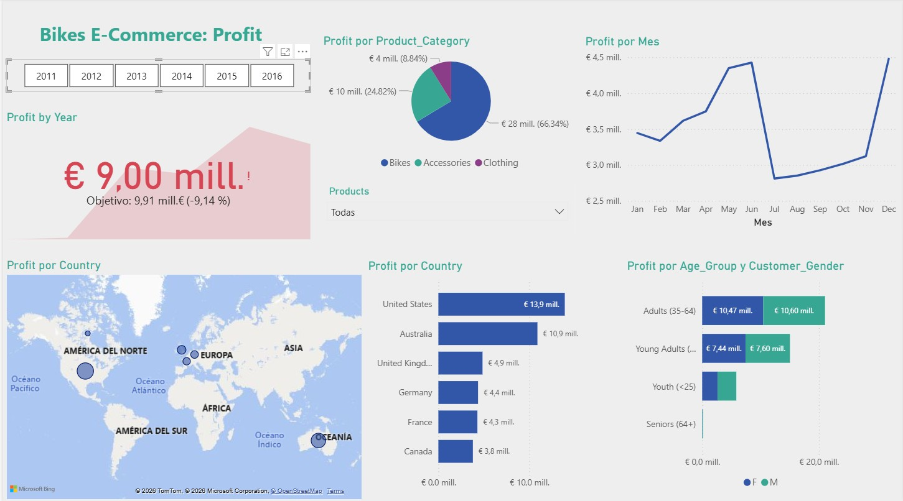

# 📊 Sales & Profit Dashboard (Power BI)

## 🧾 Executive Summary

This project consists of the development of an interactive Power BI dashboard to analyze sales performance for a cycling products distribution company between 2011 and 2016.

The solution provides insights into revenue, profit, customer behavior, and product performance, enabling data-driven decision-making through an intuitive and dynamic reporting interface.

---

## 🎯 Business Problem

Companies often manage large volumes of sales data but lack clear visibility into key performance indicators such as profit, customer segments, and product performance.

This project aims to transform raw sales data into a structured and interactive dashboard that allows users to:

- Monitor business performance over time  
- Identify high-performing products and markets  
- Understand customer behavior  
- Support strategic and marketing decisions  

---

## 📂 Dataset

The dataset contains sales data from a cycling products company, covering the period 2011–2016.

- Source: https://www.kaggle.com/datasets/sadiqshah/bike-sales-in-europe  
- Format: CSV files transformed into Excel tables  
- Size: ~113,000 records and 18 variables  

### Key Variables:
- Date (Day, Month, Year)  
- Customer demographics (Age, Gender, Age Group)  
- Geographic data (Country, State)  
- Product hierarchy (Category, Sub-category, Product)  
- Sales metrics (Quantity, Cost, Revenue, Profit)  

---

## ⚙️ Data Preparation

- Data loaded into Power BI from Excel  
- Data quality was high (no missing values or major inconsistencies)  
- No significant transformations were required in Power Query  
- Data model prepared for analysis using native Power BI capabilities  

---

## 📊 Dashboard Design

The dashboard is structured into two main pages:

### 🔹 Profit Analysis
- Focus on revenue and profitability  
- Year-based filtering  
- KPI tracking and performance overview  

### 🔹 Quantity Analysis
- Focus on sales volume  
- Filters available:
  - Age Group  
  - Gender  
  - Product Sub-category  
  - Time period  

### 🎛️ Interactivity
- Slicers allow dynamic filtering  
- Filters applied across both pages  
- Clean and intuitive layout for easy navigation  

---

## 📈 Key Insights

- Strong Pareto effect observed:
  - ~80% of profit comes from Bikes (low volume)  
  - ~20% of profit comes from Accessories & Clothing (high volume)  

- Balanced customer base:
  - ~50% male / 50% female  

- Main customer segments:
  - Adults (35–64)  
  - Young Adults (25–34)  

- Key markets:
  - United States and Australia dominate sales and profit  

---

## 💡 Business Recommendations

- Focus on high-margin products (Bikes) to maximize profitability  
- Optimize pricing and discount strategies for lower-margin categories  
- Target key customer segments (Adults & Young Adults)  
- Prioritize high-performing markets (US & Australia)  
- Explore opportunities to grow underperforming regions  

---

## 🔄 Scalability & Updates

The solution is designed to be easily updated:

- New data can be appended to the original dataset  
- Dashboard can be refreshed in Power BI  
- No structural changes required  

---

## 🛠️ Skills & Tools

- Power BI  
- Data Visualization & Dashboard Design  
- Data Analysis & Business Intelligence  
- Data Modeling  
- KPI Analysis  

---

## 📸 Dashboard Preview

---

## 📌 Use Case

This dashboard is designed for small to mid-sized businesses looking to improve visibility into sales performance without complex BI infrastructures.

---

## 🔮 Next Steps

- Incorporate additional data (e.g., shipping costs, marketing spend)  
- Define and track advanced KPIs  
- Migrate to cloud-based BI solutions for sharing and scalability  
- Add forecasting and predictive analytics  

---
